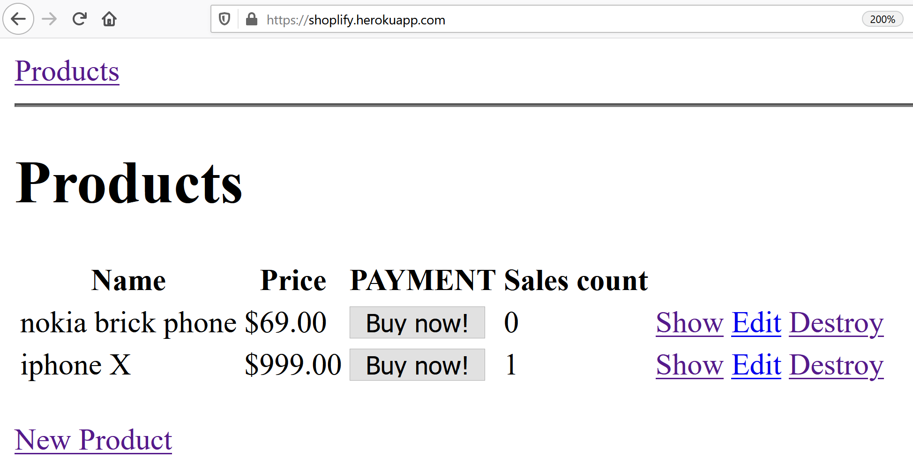
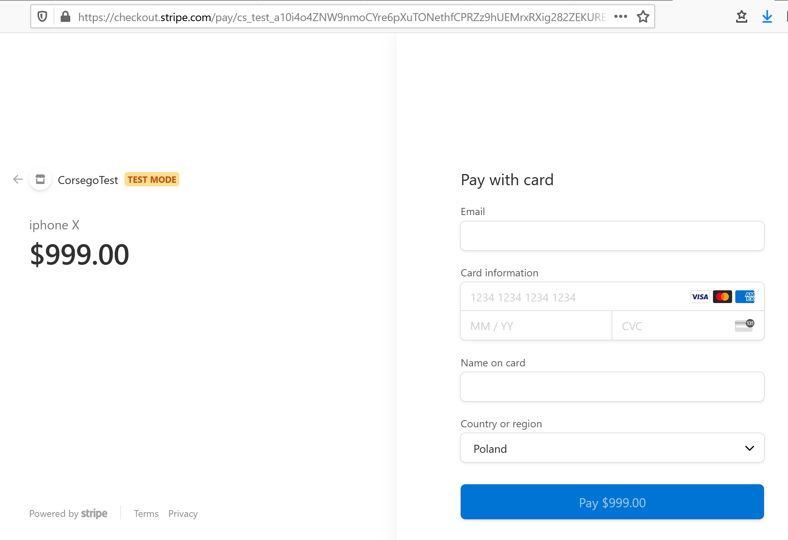

# "Buy now" button with Ruby on Rails and Stripe Checkout API

* [Live demo](https://shoplify.herokuapp.com/)
* [Github source](https://github.com/yshmarov/shoplify)
* [Stripe Dashboard](https://dashboard.stripe.com/)
* [Stripe test credit cards](https://stripe.com/docs/testing)
* [Stripe Checkout Migration guide](https://stripe.com/docs/payments/checkout/migration)

Button to buy a product


Redirects to Stripe Checkout page


****

generate scaffold:
```
rails g scaffold product name price:integer description:text --no-helper --no-assets --no-controller-specs --no-view-specs --no-test-framework --no-jbuilder 
```

****

[Guide: editing credentials](https://blog.corsego.com/ruby-on-rails-6-credentials-tldr)
```
EDITOR=vim rails credentials:edit
```

****

credentials.yml structure:
```
stripe:
  public: YOUR_CODE
  secret: YOUR_CODE
  webhook: YOUR_CODE
```

****

## Next step - associate current_user with stripe customer

* create stripe customer when creating a user

```
after_create do
  customer = Stripe::Customer.create(
    email: email,
  )
  update(stripe_customer_id: customer.id)
end
```

* associate checkout to current user / customer

```
  customer: 'cus_123',
```

## Next step - Connect products from database with Stripe Products

* add stripe_product_id to product

```
stripe_product = Stripe::Product.create(name: "iphone 14")
stripe_price = Stripe::Price.create(currency: "usd", product: stripe_product, unit_amount: 77700, lookup_key: "iphone 14")
product = Product.create(name: stripe_product.name, price: stripe_price.unit_amount, stripe_product_id: stripe_product.id)
```

* and update webhook to find current product correctly

[stripe expand docs](https://stripe.com/docs/expand)

```
Stripe::Checkout::Session.retrieve({ id: session.id, expand: ["line_items"]})
```

## Next step - list stripe products and pay for them (without local database table) 

view
```
<% @prices = Stripe::Price.list(lookup_keys: ['iphone 14', 'iphone 15'], expand: ['data.product']).data.sort_by {|p| p.unit_amount} %>
<% @prices.each do |price| %>
  <br>
  <%= price.product.name %>
  <%= button_to checkout_create_path(price: price.id), remote: true, data: { disable_with: "Connecting..." } do %>
    Buy now
    <%= price.unit_amount/100 %>
    <%= price.currency %>
  <% end %>
<% end %>
```
controller
```
@session = Stripe::Checkout::Session.create({
  payment_method_types: ['card'],
  line_items: [{
    price: params[:price],
    quantity: 1
  }],
  mode: 'payment',
  success_url: root_url,
  cancel_url: root_url,
})
```

## display Checkout API data on success

controller
```
success_url: root_url + '?session_id={CHECKOUT_SESSION_ID}',
```
view
```
<% if params[:session_id].present? %>
  <% @session = Stripe::Checkout::Session.retrieve(params[:session_id]) %>
  <% @payment_intent = Stripe::PaymentIntent.retrieve(@session.payment_intent) %>

  Payement amount: 
  <%= number_to_currency @payment_intent.amount_received / 100.0 %>.</p>
  Payment status: 
  <%= @payment_intent.status %>
  <br>
  <%= debug @session %>
  <%= debug @payment_intent %>
<% end %>
```

## possible webhook for retreiving products

```
when "checkout.session.completed"
session = event.data.object
user = User.find_by(stripe_customer_id: session.customer)
checkout_with_items = Stripe::Checkout.Session.retrieve({id: session.id, expand: ["line_items"]})
checkout_with_items.line_items.data.each do |line_item|
  product = Product.find_by(stripe_product_id: line_item.price.product)
  user.user_products.create(product: product, price: line_item.price.unit_amount)
  product.increment!(:sales_count)
end
```

## session-based shopping cart

products/index inside table
```
<% if @cart.include?(product) %>
  <%= button_to "Remove from cart", remove_from_cart_path(product), method: :delete %>
<% else %>
  <%= button_to "Add to cart", add_to_cart_path(product) %>
<% end %>
```
routes
```
post "products/add_to_cart/:id", to: "products#add_to_cart", as: "add_to_cart"
delete "products/remove_from_cart/:id", to: "products#remove_from_cart", as: "remove_from_cart"
```
products_controller.rb
```
  def add_to_cart
    id = params[:id].to_i
    session[:cart] << id unless session[:cart].include?(id)
    redirect_to products_path
  end

  def remove_from_cart
    id = params[:id].to_i
    session[:cart].delete(id)
    redirect_to products_path
  end
```
application_controller
```
  before_action :initialize_session
  before_action :load_cart

  private

  def initialize_session
    session[:cart] ||= [] # empty cart = empty array
  end

  def load_cart
    @cart = Product.find(session[:cart])
  end
```
application.html.erb
```
<h1>Shopping cart</h1>
Items:
<%= @cart.size %>
<br>
<% @cart.each do |cart_item| %>
  <br>
  <%= cart_item.name %>
  <%= link_to "x", remove_from_cart_path(cart_item), method: :delete %>
<% end %>
```

## transform items from shopping cart into stripe line_items
product.rb
```
def to_builder
	Jbuilder.new do |product|
	  product.price stripe_price_id
	  product.quantity 1
	end
end
```
checkout_controller
```
@cart.collect { |item| item.to_builder.attributes! },
```
